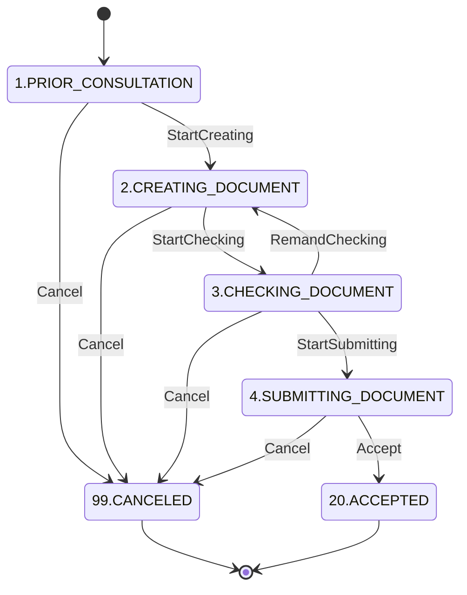

# 申出ステータス (apply_status)
作成:2023-02-05

以下の記載は、すべて2023-02-05時点における内容である点に留意すること。

## 前提
### 全国がん情報の利用の申出の流れ
全国がん情報の利用に関する申出は、大まかに以下の順序で実施される。

- 提供可否相談（申出者と事務局により行われる相談、事前に、全国がん情報の利用が見込めるかどうか、内容に対するアドバイス等（？）が行われる）
- 申出の作成（申出者による、申出内容の作成）
- 申出の承認（事務局による、申出内容が必要な情報、添付書類などの条件を満たしているかどうかの外形的な確認）
- 審議(全国がん情報の利用を許可するか否かの判断)

### 運用フロー 
案件開始当初（2022年1月頃）に作成した運用フロー図。参考資料として確認すること
https://app.diagrams.net/#G1Un9xUXe90Q3wSaO0fGenJFLSX8BGzXPB

※一部の名称など、現時点のシステムと若干異なっている箇所がある点に留意する

## 概要(申出ステータスとは？)
- 全国がん情報利用の申出の、現時点での状態を示す。
- データベース上には、applies.status として保存されている。
- ステータス内容は、以下のクラスにて定義する。
[https://github.com/git-balocco/ncc01/blob/main/packages/Apply/Enterprise/Classification/ApplyStatuses.php](https://github.com/git-balocco/ncc01/blob/main/packages/Apply/Enterprise/Classification/ApplyStatuses.php)
- このステータスを用いた何らかの判断などの仕様は、以下のクラスにて定義する。
[https://github.com/git-balocco/ncc01/blob/main/packages/Apply/Enterprise/Entity/ApplyStatus.php](https://github.com/git-balocco/ncc01/blob/main/packages/Apply/Enterprise/Entity/ApplyStatus.php)  
  - 例えば、ステータスが「申出文書 作成中」であるかどうか、を判定する処理は、isCreatingDocument() として実装されている
  - ステータスに関する仕様、判断、処理に関しては、このApplyStatus に実装を集めることで、保守性が損なわれないようにすること。
  ~~~ php
   // NG:isCreatingDocument() を利用していないため、保守性が低下する
   if(ApplyStatuses::CREATING_DOCUMENT === $statusId){
     // 申出文書作成中 の場合の処理
   }
  
   //OK:isCreatingDocument() を利用しているので、、保守性が低下しない
   if($applyStatusObject->isCreatingDocument()){
     // 申出文書作成中 の場合の処理
   }
  ~~~

## 詳細
### 状態遷移図
2023-08-02時点

### 1.データ提供可否 相談中 PRIOR_CONSULTATION
- 初期ステータス。
- 申出者からのアクションにより、提供可否相談が開始された段階。
- この段階では、申出者と事務局が面会、本システムの利用、電話、FAX等の手段で相談を行うので、「相談中」と表現する。
- システム上では、「がん情報 提供依頼可否相談」画面（/apply/start）で行われる。
- 申出が作成されるときに、このステータスとなる。(applies.status のdefaultは 1 )
- 申出作成のユースケースは、[https://github.com/git-balocco/ncc01/blob/main/packages/Apply/Application/Usecase/CreateApplyInterface.php](https://github.com/git-balocco/ncc01/blob/main/packages/Apply/Application/Usecase/CreateApplyInterface.php) である。
- ユースケースの実装クラスは、[https://github.com/git-balocco/ncc01/blob/main/packages/Apply/Application/UsecaseInteractor/CreateApply.php](https://github.com/git-balocco/ncc01/blob/main/packages/Apply/Application/UsecaseInteractor/CreateApply.php) である。

### 2.申し出文書 作成中 CREATING_DOCUMENT 
- 提供可否相談が完了し、申出の具体的な内容の入力をシステム上で実施する段階。
- この段階では、申出者が本システムを利用して申出のための資料を作成するため、「作成中」と表現する。
- このステータスへの遷移は、事務局側が実施する。
- 2.申し出文書 作成中 ステータスに遷移する契機は、事務局側の管理画面にて、「申出開始」ボタンを押下すること。
- システム上では、「全国がん登録情報利用申出 事前相談中 一覧」画面（/apply/lists/prior_consultation）で行われる。
- 申出開始は、以下の2つのユースケースを利用して行われている
  - 「申出スタータス変更」ユースケース [https://github.com/git-balocco/ncc01/blob/main/packages/Apply/Application/Usecase/ChangeStatusInterface.php](https://github.com/git-balocco/ncc01/blob/main/packages/Apply/Application/Usecase/ChangeStatusInterface.php)
  - ユースケースの実装クラス [https://github.com/git-balocco/ncc01/blob/main/packages/Apply/Application/UsecaseInteractor/ChangeStatus.php](https://github.com/git-balocco/ncc01/blob/main/packages/Apply/Application/UsecaseInteractor/ChangeStatus.php)
  - 「申出開始通知送信」ユースケース [https://github.com/git-balocco/ncc01/blob/main/packages/Notification/Application/Usecase/SendStartCreatingDocumentInterface.php](https://github.com/git-balocco/ncc01/blob/main/packages/Notification/Application/Usecase/SendStartCreatingDocumentInterface.php)
  - ユースケースの実装クラス[https://github.com/git-balocco/ncc01/blob/main/packages/Notification/Application/UsecaseInteractor/SendStartCreatingDocument.php](https://github.com/git-balocco/ncc01/blob/main/packages/Notification/Application/UsecaseInteractor/SendStartCreatingDocument.php)

### 3. CHECKING_DOCUMENT 申出文書 確認中
- 申出の具体的な内容を入力し終わり、内容チェックのために事務局側で確認を行う段階。
- この段階では、事務局が申し出内容の確認を行うため、「確認中」と表現する。
- このステータスへの遷移は、申出者が実施する。
- このステータスへの遷移は、システム上では「全国がん登録情報利用申出(申出番号:**) 概要」画面（/apply/detail/overview/**）で行われる。
- 上記画面において、申請の入力内容が所定の条件を満たしている場合のみ、「申出文書 承認依頼」ボタンが表示される仕様となっている。
- 申請の内容に対するチェックは、[https://github.com/git-balocco/ncc01/tree/main/packages/Apply/Enterprise/Spec/CheckingDocument](https://github.com/git-balocco/ncc01/tree/main/packages/Apply/Enterprise/Spec/CheckingDocument) 以下に配置されるクラス群によって構成されている。
- 申出文書 承認依頼は、以下の2つのユースケースを利用して行われている。
  - 「申出ステータス変更」ユースケース [https://github.com/git-balocco/ncc01/blob/main/packages/Apply/Application/Usecase/ChangeStatusInterface.php](https://github.com/git-balocco/ncc01/blob/main/packages/Apply/Application/Usecase/ChangeStatusInterface.php)
  - ユースケースの実装クラス [https://github.com/git-balocco/ncc01/blob/main/packages/Apply/Application/UsecaseInteractor/ChangeStatus.php](https://github.com/git-balocco/ncc01/blob/main/packages/Apply/Application/UsecaseInteractor/ChangeStatus.php)
  - 「承認開始通知送信」[https://github.com/git-balocco/ncc01/blob/main/packages/Notification/Application/Usecase/SendStartCheckingDocumentInterface.php](https://github.com/git-balocco/ncc01/blob/main/packages/Notification/Application/Usecase/SendStartCheckingDocumentInterface.php)
  - ユースケースの実装クラス [https://github.com/git-balocco/ncc01/blob/main/packages/Notification/Application/UsecaseInteractor/SendStartCheckingDocument.php](https://github.com/git-balocco/ncc01/blob/main/packages/Notification/Application/UsecaseInteractor/SendStartCheckingDocument.php)

### 4.SUBMITTING_DOCUMENT 申出文書 提出中
- 事務局でのチェックが完了し、内容に問題ないことが確認された段階。
- この段階では、申出者がPDFの印刷、郵送を行い、事務局に提出を行うため、「提出中」と表現する。
  - ※2023-02-05時点の段階では郵送は廃止となり、事務局が本システムを利用してPDFをダウンロードすることで、「提出」しているものとみなすことになった。
  - ※このため、提出中、というステータス名は実態と若干乖離しているようにも思える。（どちらかというと「提出済」あるいは、「審議対象入り」とでも言うべきか？）
- このステータスへの遷移は、事務局が実施する。
- このステータスへの遷移は、システム上では以下のいずれかの画面にて、「承認」ボタンを行うことで実施される。
  - 「全国がん登録情報利用申出 申出文書作成中（リンケージ）一覧)」画面（/apply/lists/creating_linkage）
  - 「全国がん登録情報利用申出 申出文書作成中（集計統計）一覧」画面（/apply/lists/creating_statistics）
- 申出文書の承認は、以下の2つのユースケースを利用して行われている。
  - 「申出ステータス変更」ユースケース [https://github.com/git-balocco/ncc01/blob/main/packages/Apply/Application/Usecase/ChangeStatusInterface.php](https://github.com/git-balocco/ncc01/blob/main/packages/Apply/Application/Usecase/ChangeStatusInterface.php)
  - ユースケースの実装クラス [https://github.com/git-balocco/ncc01/blob/main/packages/Apply/Application/UsecaseInteractor/ChangeStatus.php](https://github.com/git-balocco/ncc01/blob/main/packages/Apply/Application/UsecaseInteractor/ChangeStatus.php)
  - 「提出開始通知送信」[https://github.com/git-balocco/ncc01/blob/main/packages/Notification/Application/Usecase/SendStartSubmittingDocumentInterface.php](https://github.com/git-balocco/ncc01/blob/main/packages/Notification/Application/Usecase/SendStartSubmittingDocumentInterface.php)
  - ユースケースの実装クラス [https://github.com/git-balocco/ncc01/blob/main/packages/Notification/Application/UsecaseInteractor/SendStartSubmittingDocument.php](https://github.com/git-balocco/ncc01/blob/main/packages/Notification/Application/UsecaseInteractor/SendStartSubmittingDocument.php)

### 5.UNDER_REVIEW 審査中
- 審議会にて、審議が行われている段階。
  - ※2023-05-17 時点では、このステータスに遷移する機能等は実装されていない。

### 20.ACCEPTED 応諾
- 審議会での審議により、この申出による全国がん情報の利用を許可することが決定された状態。
- 相談開始から一連の手続きを経て遷移する、申出ステータスの最終状態の1つである。
  - ※2023-03-31までの改修、v1.2.0において追加された。
  - ※以降の機能追加において、5.UNDER_REVIEW 審査中　と　20.ACCEPTED 応諾 の間にいくつかのステータスが追加される予定があるため、20.とした。

### 99.CANCEL 中止
- 事務局により、申出の中止が決定された状態。
- 相談開始から一連の手続きを経て遷移する、申出ステータスの最終状態の1つである。
- 1.相談中、2.作成中、3.確認中、4.提出中、いずれかの状態から、事務局が中止と決定した申出がこのステータスに遷移する。
- このステータスへの遷移は、システム上では以下のいずれかの画面にて、「中止」ボタンを行うことで実施される。
  - /apply/lists/prior_consultation
  - /apply/lists/creating_linkage
  - /apply/lists/creating_statistics
  - /apply/lists/submitting
- 中止は、以下のユースケースを利用して行われている。
  - 「申出ステータス変更」ユースケース [https://github.com/git-balocco/ncc01/blob/main/packages/Apply/Application/Usecase/ChangeStatusInterface.php](https://github.com/git-balocco/ncc01/blob/main/packages/Apply/Application/Usecase/ChangeStatusInterface.php)
  - ユースケースの実装クラス [https://github.com/git-balocco/ncc01/blob/main/packages/Apply/Application/UsecaseInteractor/ChangeStatus.php](https://github.com/git-balocco/ncc01/blob/main/packages/Apply/Application/UsecaseInteractor/ChangeStatus.php)

## 備考、経緯等
### 変更申出機能の実装、および「応諾」ステータス追加に関する経緯、備考
- 2023-02-03時点で、システムとして表現、実装されているのは、申出の承認　までだった。
- 2023-02-03～2023-03-31 期間での追加改修により、[変更申出](./request-for-chang.md)　に関する機能の実装に伴い、「応諾」のステータスおよび、「応諾」を行う簡易的な機能が追加された。
- ただし、承認～応諾に至るまでの詳細なプロセスの業務効率化については、2023年度以降に進める予定となっていて、2023-05-17 v1.2.4時点での機能は簡易的な内容となっている。
- 2023-05-17 v1.2.4 時点でのシステム上のステータス遷移は　4.提出中 => 20.応諾 となっているが、現実の運用フローにおいては「提出中」と「応諾」の間にいくつかの段階がある。
    - 開発初期段階で整理した [業務フロー図](https://drive.google.com/drive/u/0/folders/0AJFPaWVI5ZnFUk9PVA) においては、以下の2つの段階がある。
        - 審査申請中
        - 審査中

